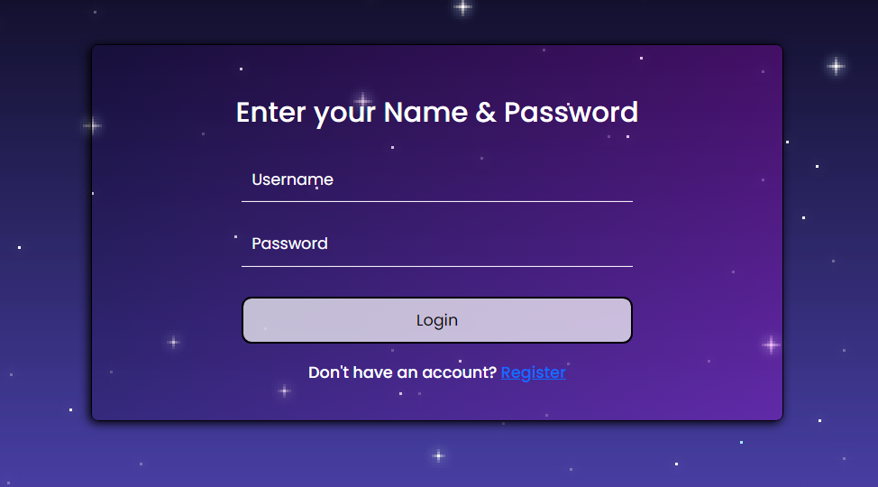
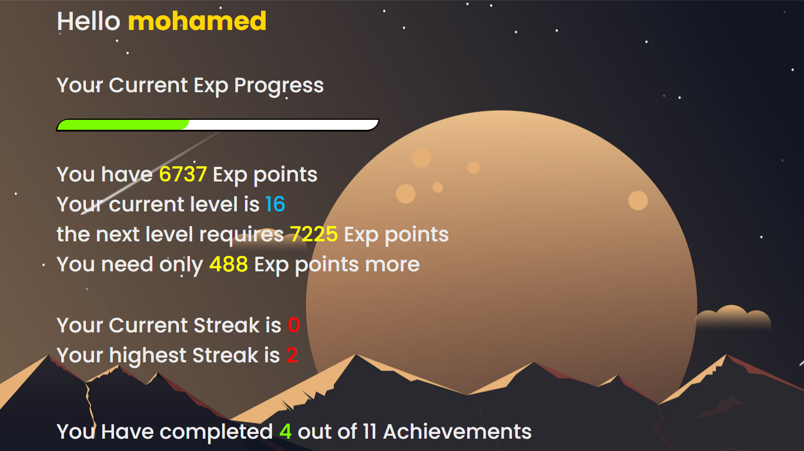
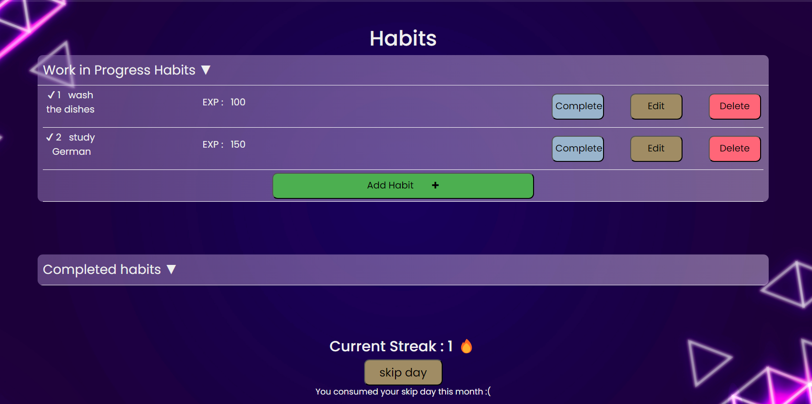
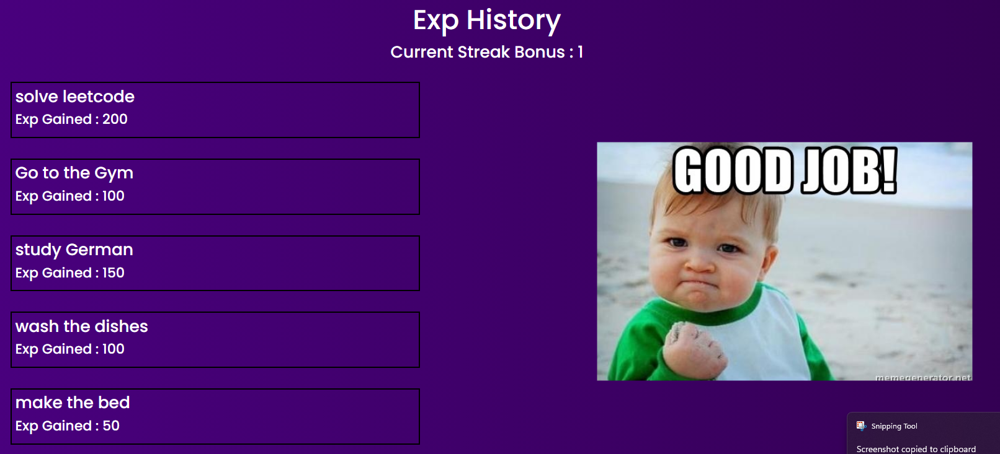
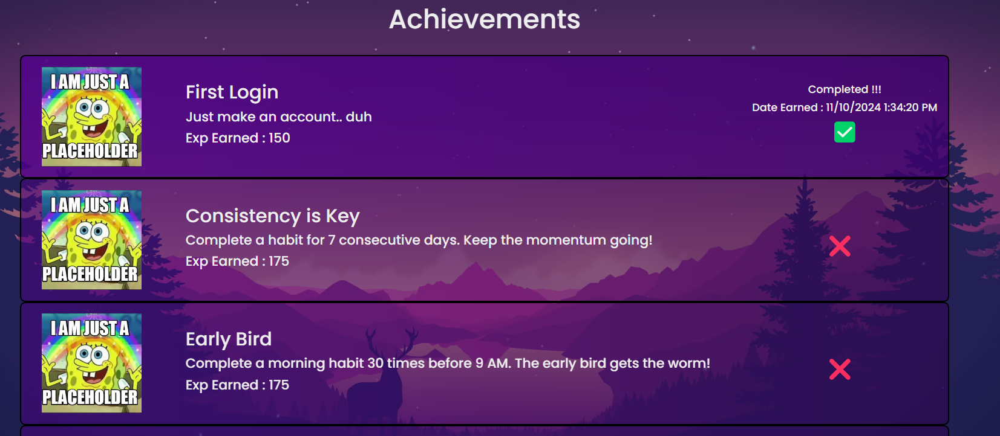

# Gamified Task Manager

## Overview
This webpage consists of multiple pages that gamify your daily tasks by allowing users to gain experience points (XP), level up, and unlock achievements.

## Table of Contents

- [Overview](#overview)
- [Features](#features)
- [Installation](#installation)
- [Feedback & Contribution](#feedback--contribution)

## Features 
- **Authentication and Authorization**: This webpage has a working authentication and authorization system using JWT tokens to track the user's session expiration date.

    

- **User Profile**: The app tracks the user's level, their current progress to the next level, their current and highest streaks, and how many achievements they have unlocked.

    

- **Habit Management**: On the Habit page, users can add, modify, delete, and complete their tasks. The app tracks the user's completed and non-completed tasks, updates their streak, and allows them to skip a day to retain their streak if they are busy (only once a month).

    

- **Experience Tracking**: The Experience page tracks the XP history of the player (including tasks and achievements) and calculates a bonus XP reward based on the user's current streak.

    

- **Achievement System**: The Achievement page tracks all the achievements the user has (completed or not), when they were unlocked, and the conditions for unlocking each achievement.

    

## Installation

1. **First, install the API**
   
    1. Clone the repository:
        ```sh
        git clone https://github.com/1Gazzar1/Gamified-Habit-Tracker.git
        ```
    2. Create a file named `appsettings.json` with the following content, replacing the placeholders with your actual values:
        ```json
        {
            "Logging": {
                "LogLevel": {
                    "Default": "Information",
                    "Microsoft.AspNetCore": "Warning"
                }
            },
            "AllowedHosts": "*",
            "ConnectionStrings": {
                "DefaultConnection": "YourDefaultConnection"
            },
            "Jwt": {
                "Issuer": "YourIssuer",
                "Audience": "YourAudience",
                "Key": "YourSecretKey"
            }
        }
        ```
        > Make sure to **replace** these values with your own 

2. **Now, install the Blazor app**
    ```sh
    git clone https://github.com/1Gazzar1/GHT-Blazor.git
    ```

> Don't forget to run **both** projects.

## Feedback & Contribution
We welcome feedback and contributions! If you have suggestions or issues, please open an issue on GitHub or submit a pull request. Your contributions help improve the project!

